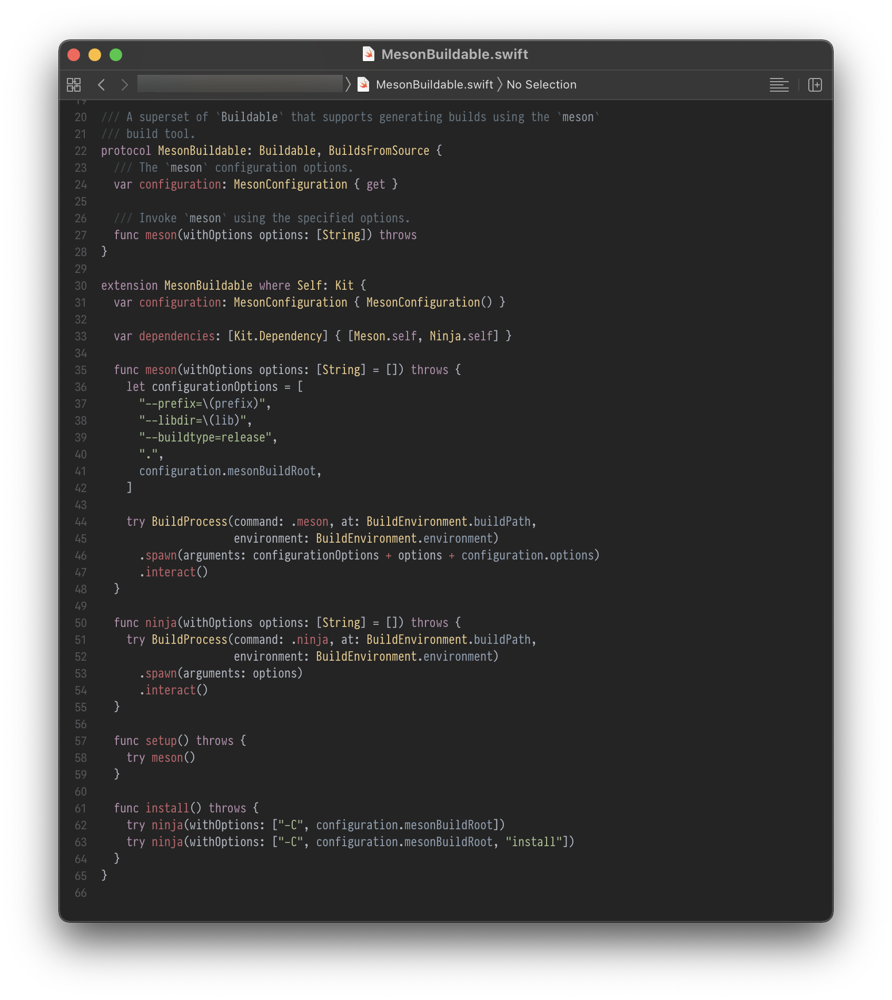

# Spacegray for Xcode

A color scheme based on https://github.com/ajh17/Spacegray.vim, which is
inspired by https://github.com/zdne/spacegray-xcode, which is a port of
https://github.com/kkga/spacegray. It's spacegray all the way down!


## Screenshots



The font used in the screenshot is the amazing [Pragmata
Pro](https://fsd.it/shop/fonts/pragmatapro/).


## Installation

```zsh
mkdir ~/Library/Developer/Xcode/UserData/FontAndColorThemes 2>/dev/null; \
          git clone https://github.com/ajh17/spacegray-xcode.git && \
          cp ./spacegray-xcode/Spacegray.xccolortheme ~/Library/Developer/Xcode/UserData/FontAndColorThemes
```
